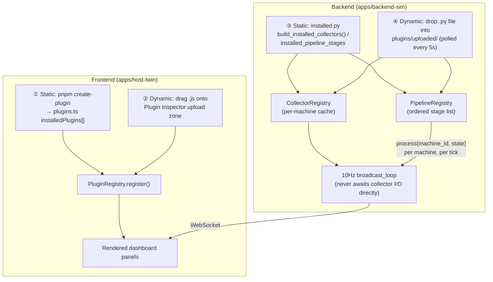

# How to Run SDF Digital Twin

## Prerequisites

| Tool | Version | Install |
|------|---------|---------|
| Node.js | 18+ | [nodejs.org](https://nodejs.org) |
| pnpm | 9+ | `npm install -g pnpm` |
| Python | 3.11+ | [python.org](https://python.org) |
| uv | latest | `pip install uv` |

Anthropic API key → [console.anthropic.com](https://console.anthropic.com)

---

## Project Structure

```
sdf-digital-twin/
├── apps/
│   ├── backend-sim/   ← FastAPI + WebSocket server
│   └── host-twin/     ← Next.js frontend
└── packages/          ← Shared types & SDK
```

---

## 1. Backend

```bash
cd apps/backend-sim
uv sync
```

Create `.env`:

```bash
copy .env.example .env    # Windows
cp .env.example .env      # macOS / Linux
```

Edit `.env`:

```
ANTHROPIC_API_KEY=sk-ant-...
```

Run:

```bash
uv run uvicorn main:app --reload
```

→ `http://localhost:8000` · WebSocket: `ws://localhost:8000/ws`

---

## 2. Frontend

New terminal — run from the **repo root**:

```bash
pnpm install
pnpm --filter @sdf/host-twin run dev
```

→ `http://localhost:3000`

> `NEXT_PUBLIC_WS_URL` defaults to `ws://localhost:8000/ws` in development.

---

## Tests

```bash
# Backend
cd apps/backend-sim && uv run pytest

# Frontend (from repo root)
pnpm --filter @sdf/host-twin run test
```

---

## Plugins

There are exactly **4 places** a plugin can be added — 2 on the frontend, 2 on the backend. The Plugin Inspector panel (visible whenever the conditions below are met) shows what's currently registered, plus any registration/activation errors, for all 4 paths at once.



Backend note on the diagram: a `Collector` only *feeds* the cache that `broadcast_loop` reads from — it never blocks the 10Hz tick even if collection is slow. A `PipelineStage` runs once per machine per tick, in registration order, transforming the state on its way out (e.g. flipping `status` to `"fault"` past a threshold). Both static (`installed.py`) and dynamic (`uploaded/`) registration funnel into the exact same two registries, so there's no behavioral difference between how a plugin got there.

### ① Frontend static registration

```bash
pnpm create-plugin temperature-alert
```

Generates `apps/host-twin/plugins/temperatureAlertPlugin.tsx` (+ a smoke test in `plugins/__tests__/`) and auto-registers it in `apps/host-twin/lib/plugins.ts`'s `installedPlugins` array. This is how every built-in example plugin got there. Requires a rebuild/redeploy to take effect (it's baked into the client bundle).

**Minimal worked example:** `apps/host-twin/plugins/helloPanelPlugin.tsx` — generated by this exact command (`pnpm create-plugin hello-panel`) and filled in with the smallest useful body: reads the live machine count via the one read whitelist API (`props.useStoreSlice`), no other host access. Good starting point to copy when writing your own.

### ② Frontend dynamic loading (dev-only)

1. Run the frontend where the Plugin Inspector panel is visible (see "Dev Mode" below — true by default in local `pnpm dev`).
2. Open the Plugin Inspector panel and drag a `.js` file onto the upload zone — try `examples/plugins/machine-counter-plugin.js`.
3. The file loads via native browser `import()` with zero rebuild. It must `export default` a plain `{id, name, version, activate}` object and cannot use bare-specifier imports (no bundler involved) — see `CONTRIBUTING.md` for the full contract.

### ③ Backend static registration

Implement the `Collector` (per-machine data collection, own polling cadence) or `PipelineStage` (per-tick state transform) protocol from `apps/backend-sim/plugins/contracts.py`, then add an instance to `apps/backend-sim/plugins/installed.py`'s `build_installed_collectors()` / `installed_pipeline_stages`. Requires a backend restart to take effect.

**Minimal worked example:** `examples/plugins/example_collector.py` — a bare-bones `Collector` (`ExampleRandomWalkCollector`) that generates random-walk sensor values for a standalone machine id. Deliberately **not** wired into `installed.py`, for the same reason noted in the file's own docstring: a `Collector` claiming a machine id already owned by `SimulatorCollector` (`M1`–`M5`) raises immediately, while claiming a brand-new id registers/polls fine but is invisible on the dashboard (`broadcast_loop` only forwards machines placed on the canvas) — so unlike a `PipelineStage`, a `Collector` can't be demoed by just dropping it in and watching the screen. Use it to check the *shape* of a working implementation, and read `apps/backend-sim/plugins/simulator_collector.py` (the real production one) alongside it.

### ④ Backend dynamic loading

1. With the backend running, drop a `.py` file implementing the `Collector` or `PipelineStage` protocol into `apps/backend-sim/plugins/uploaded/`.
2. A background poller picks it up within 5 seconds and registers it — check the Plugin Inspector panel or server logs for confirmation.
3. Files in this directory are gitignored (`apps/backend-sim/plugins/uploaded/*.py`) — don't commit test uploads there.

**Worked example:** `examples/plugins/example_pipeline_stage.py` — chosen (over a `Collector`) specifically because a `PipelineStage` transforms machines already on the dashboard, so its effect (a machine flipping to `"fault"` once vibration crosses a threshold) is visible within seconds of dropping the file in, no canvas setup required.

### Demo mode (no backend required)

Toggle via the "데모 컨트롤러" panel's start/stop button, or it auto-activates whenever the WebSocket isn't `"connected"` (frontend-only mock data generator, no backend needed).

---

## Troubleshooting: stale uvicorn worker (Windows)

Symptom: WebSocket connects but no data, or code changes not reflected.

Cause: `--reload` on Windows can leave orphan worker processes holding port 8000.

**Verify** (check `started_at` / `pid` changed after restart):

```bash
curl http://localhost:8000/health
```

**Kill all workers** (PowerShell):

```powershell
$p = (Get-NetTCPConnection -LocalPort 8000 -State Listen -EA SilentlyContinue).OwningProcess
if ($p) { taskkill /PID $p /T /F }
```

**Restart** the server, then confirm `started_at` updated.

> Add `PYTHONUNBUFFERED=1` before `uv run` if print logs aren't appearing immediately.

---

## Production Deployment

### Frontend — Vercel

반드시 **repo root**에서 실행해야 합니다. (pnpm workspace 의존성 해소에 전체 모노레포가 필요)

```bash
# repo root 에서
npx vercel login          # 최초 1회
npx vercel deploy --prod --yes
```

Backend 배포 후 WebSocket URL 환경변수 설정:

```bash
# repo root 에서
npx vercel env add NEXT_PUBLIC_WS_URL production
# wss://<your-railway-app>.up.railway.app/ws
npx vercel deploy --prod --yes
```

> `apps/host-twin` 하위에서 `vercel deploy`를 실행하면 `workspace:*` 의존성을 해소할 수 없어 `npm install` 오류가 발생합니다.

### Dev Mode로 배포하기 (Live URL에서 플러그인 체험)

Plugin Inspector 패널(과 프론트 동적 업로드 UI)은 기본적으로 `NODE_ENV !== "production"`일 때만 보입니다. 문제는 Next.js가 `next build` 실행 시 **Vercel Environment(Production/Preview)와 무관하게 `NODE_ENV`를 항상 `"production"`으로 고정**한다는 점입니다 — 그냥 재배포하거나 Preview로 배포를 바꾸는 것만으로는 절대 우회되지 않습니다.

그래서 별도의 public 환경변수 `NEXT_PUBLIC_ENABLE_DEV_TOOLS`로 이 게이트를 분리했습니다 (`apps/host-twin/store/factoryStore.ts`):

```ts
visible: process.env.NODE_ENV !== "production" || process.env.NEXT_PUBLIC_ENABLE_DEV_TOOLS === "true"
```

배포된 환경에서 켜려면:

```bash
# repo root 에서
npx vercel env add NEXT_PUBLIC_ENABLE_DEV_TOOLS production
# 값 입력: true
npx vercel deploy --prod --yes
```

껐다가 다시 프로덕션처럼 숨기려면 `npx vercel env rm NEXT_PUBLIC_ENABLE_DEV_TOOLS production` 후 재배포하면 됩니다.

**공개 노출에 대한 참고:** 프론트 동적 업로드(②)는 순수 클라이언트 사이드 동작입니다 — 방문자가 `.js` 파일을 올려도 그 방문자 **자신의 브라우저 탭** 안에서만 `import()`로 실행되고, 서버나 다른 사용자에게는 아무 영향이 없습니다(브라우저 개발자 도구로 임의 코드를 실행하는 것과 동일한 신뢰 경계). 백엔드 동적 로딩(④)은 파일시스템 경로(`plugins/uploaded/`)에 직접 파일을 넣어야 하는 방식이라 이 플래그와 무관하게 원격 노출 경로 자체가 없습니다. 자세한 위협 모델은 `CONTRIBUTING.md`의 "화이트리스트에 대한 중요한 참고사항"과 Phase 4 설계 문서를 참고하세요.

### Backend — Railway

```bash
npm install -g @railway/cli
railway login

cd apps/backend-sim
railway init
railway variables set ANTHROPIC_API_KEY=sk-ant-...
railway up
```

Railway dashboard settings:
- **Root Directory:** `apps/backend-sim`
- **Start Command:** `uv run uvicorn main:app --host 0.0.0.0 --port $PORT`

---

## Live URLs

| Service | URL | Dev Mode |
|---------|-----|----------|
| Frontend | https://sdf-digital-twin.vercel.app | `NEXT_PUBLIC_ENABLE_DEV_TOOLS` — see above |
| Backend | TBD after Railway deploy | — |
